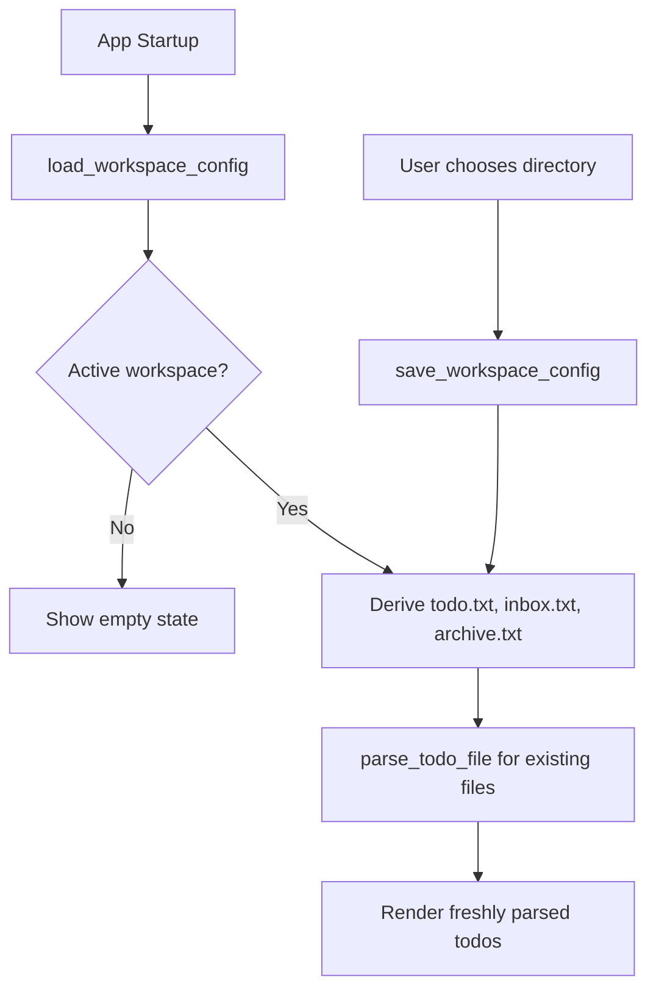

# Workspace Persistence Implementation Plan

> Historical note: this plan predates the current product spec and is partially implemented.
> Use `docs/product-spec.md` as the authoritative roadmap for future feature work.

Persist workspace configuration globally as TOML, storing workspace roots and metadata while keeping parsed todo contents in memory only. On startup the app should load the active workspace, derive known todo-family files from its root, and re-read existing files from disk.

This document is split into implementation sections that can be handled by separate agents. Each section should keep changes scoped to its listed files and acceptance criteria.

## Product Invariants

- The actual `todo.txt` family files remain the source of truth.
- Config stores user-meaningful workspace metadata, not parsed task data.
- Workspace config uses root directories instead of individual todo file paths.
- The app derives known todo-family files from each workspace root.
- Parsed todo contents stay in memory and are re-read from disk on startup.
- All app-owned file updates use atomic writes.

## Current Baseline

The UI currently keeps a single parsed todo file in Svelte state after invoking the Rust parser:

```svelte
<script lang="ts">
	import { invoke } from "@tauri-apps/api/core";
	import { open } from "@tauri-apps/plugin-dialog";
	import { parseTodoFileResponse, type TodoFile } from "$lib/todo";

	let todoFile = $state<TodoFile | null>(null);
	let error = $state("");
	let isLoading = $state(false);

	async function openTodoFile() {
		// ... picker, parse_todo_file, set todoFile
	}
</script>
```

The Rust backend currently exposes `parse_todo_file`, which reads a selected file and parses it through the shared todo.txt parser.

## Section 1: Workspace Config Model

### Goal

Define the persisted config shape and keep it compatible with future workspace features.

### Target Files

- `src-tauri/src/lib.rs`
- Optionally split into `src-tauri/src/workspace_config.rs` if `lib.rs` starts getting crowded.

### Tasks

1. Add serializable Rust structs:
   - `WorkspaceConfig`
   - `Workspace`
2. Include these fields:
   - `version: u32`
   - `active_workspace_id: Option<String>`
   - `workspaces: Vec<Workspace>`
   - `Workspace.id: String`
   - `Workspace.name: String`
   - `Workspace.color: String`
   - `Workspace.root: String`
3. Add a default empty config with `version = 1`, no active workspace, and an empty workspace list.
4. Keep parsed todo items, skipped lines, and file contents out of this model.

### Target TOML

Store this as `workspaces.toml` under Tauri's app config directory using the Tauri path resolver, not a hardcoded OS path.

```toml
version = 1
active_workspace_id = "default"

[[workspaces]]
id = "default"
name = "Default"
color = "#396cd8"
root = "/Users/julian/todos"
```

### Acceptance Criteria

- The config structs serialize and deserialize with `serde`.
- Missing config can be represented as a valid default config.
- The model has room for multiple workspaces without changing the top-level shape.

## Section 2: Rust Dependencies

### Goal

Add the crates needed for TOML serialization and atomic writes.

### Target Files

- `src-tauri/Cargo.toml`
- `src-tauri/Cargo.lock`

### Tasks

1. Add the `toml` crate for reading and writing `workspaces.toml`.
2. Add the `atomicwrites` crate.
3. Do not remove existing dependencies.

### Acceptance Criteria

- `cargo check --manifest-path src-tauri/Cargo.toml` can resolve the new dependencies.
- Future config writes can use `atomicwrites::AtomicFile`.

## Section 3: Config File IO Commands

### Goal

Expose backend commands for loading and saving workspace config.

### Target Files

- `src-tauri/src/lib.rs`
- Optional `src-tauri/src/workspace_config.rs`

### Tasks

1. Add a helper to resolve `workspaces.toml` under Tauri's app config directory.
2. Add `load_workspace_config`:
   - If the file is missing, return the default config.
   - If the file exists, read and parse TOML.
   - Return a readable error if parsing fails.
3. Add `save_workspace_config`:
   - Create the app config directory if needed.
   - Serialize the full config to TOML.
   - Write via `atomicwrites::AtomicFile` with overwrite enabled.
4. Register both commands alongside `parse_todo_file`.

### Acceptance Criteria

- `load_workspace_config` never fails just because no config file exists yet.
- `save_workspace_config` never performs a direct non-atomic overwrite.
- An interrupted config write should leave either the old valid TOML or the new valid TOML, never a partial file.

## Section 4: Workspace File Resolution

### Goal

Derive known todo-family files from a workspace root.

### Target Files

- `src-tauri/src/lib.rs`
- Optional `src-tauri/src/workspace_config.rs`
- Optional frontend type file if the resolved shape is exposed to Svelte.

### Tasks

1. Define known workspace file kinds:
   - `todo`: `todo.txt`, required now.
   - `inbox`: `inbox.txt`, optional future file.
   - `archive`: `archive.txt`, optional future file.
2. Add a helper or command that takes a workspace root and returns resolved file paths and existence flags.
3. Treat missing `todo.txt` as a workspace warning.
4. Treat missing `inbox.txt` and `archive.txt` as non-fatal.
5. Keep parsing delegated to the existing `parse_todo_file` command for files that exist.

### Acceptance Criteria

- Workspace roots are the only paths persisted in config.
- The app can derive `todo.txt`, `inbox.txt`, and `archive.txt` consistently from the root.
- Optional files can be absent without blocking the workspace from loading.

## Section 5: Frontend Startup Restore

### Goal

Load the active workspace on startup and parse current file contents from disk.

### Target Files

- `src/routes/+page.svelte`
- Optional `src/lib/workspace.ts` for TypeScript schemas and helpers.

### Tasks

1. Add TypeScript types or Zod schemas for the workspace config response.
2. On component mount, call `load_workspace_config`.
3. Select the active workspace from `active_workspace_id`.
4. Derive or request known files for the active workspace root.
5. Call `parse_todo_file` for existing files.
6. Store parsed todo data in Svelte state only.
7. Show a clear empty state if no workspace is configured.
8. Show a clear warning if the active workspace has no `todo.txt`.

### Acceptance Criteria

- Restarting the app restores the active workspace.
- File contents are re-read from disk on every startup.
- Parsed todo data is not persisted to TOML.
- A missing or invalid workspace does not crash the UI.

## Section 6: Workspace Directory Selection

### Goal

Let the user choose a workspace directory and persist it as config.

### Target Files

- `src/routes/+page.svelte`
- Optional `src/lib/workspace.ts`

### Tasks

1. Change the picker flow from choosing a single todo file to choosing a directory.
2. Create or update a default workspace using the selected directory as `root`.
3. Set that workspace as `active_workspace_id`.
4. Save the full config through `save_workspace_config`.
5. Reload derived files after saving.

### Acceptance Criteria

- The user can select a directory as a workspace.
- The selected directory persists across app restarts.
- The app derives `todo.txt` from that directory instead of storing a direct todo file path.

## Section 7: Future Todo File Mutations

### Goal

Establish the write strategy for later features such as quick capture, inbox triage, and archive completed.

### Target Files

- Future Rust file mutation commands.
- Future frontend actions.

### Tasks

1. For any mutation of `todo.txt`, `inbox.txt`, or `archive.txt`, read the full current file.
2. Construct the complete next file contents in memory.
3. Write using `atomicwrites::AtomicFile` with overwrite enabled.
4. Re-read and re-parse after the write completes.
5. Avoid partial line-by-line in-place mutation.

### Acceptance Criteria

- Todo-family file writes follow the same atomic-write rule as config writes.
- After mutation, the UI reflects freshly parsed file contents.
- The plain text files remain readable and portable.

## Data Flow



## Final Validation

- Run `pnpm check` for Svelte and TypeScript.
- Run `pnpm test:rust` to ensure the new Rust commands compile and existing parser tests still pass.
- Manually launch the app, choose a workspace directory, quit, edit `todo.txt` externally, reopen, and confirm the updated contents appear.
- Review interrupt-safe behavior around config writes, since `workspaces.toml` should either remain old-valid or become new-valid, never partial.
